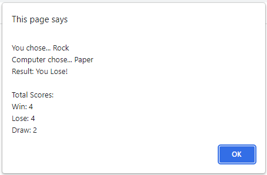

# Rock, Paper, Scissors

**Rules for rock-paper-scissors**

* Rock: wins against scissors, loses to paper, and ties against itself.
* Paper: wins against rock, loses to scissors, and ties against itself.
* Scissors: wins against paper, loses to rock, and ties against itself.

## Usage

Play Rock, Paper, Scissors against an automated opponent.   
Enter R, P, or S to signify your choice of rock, paper, or scissors.   
The computer to choose at random R, P, or S in return.   
Total wins, ties, and losses displayed after 10 rounds.   

...keep playing!

## License
	
**MIT** - Please refer to the LICENSE in the repository.